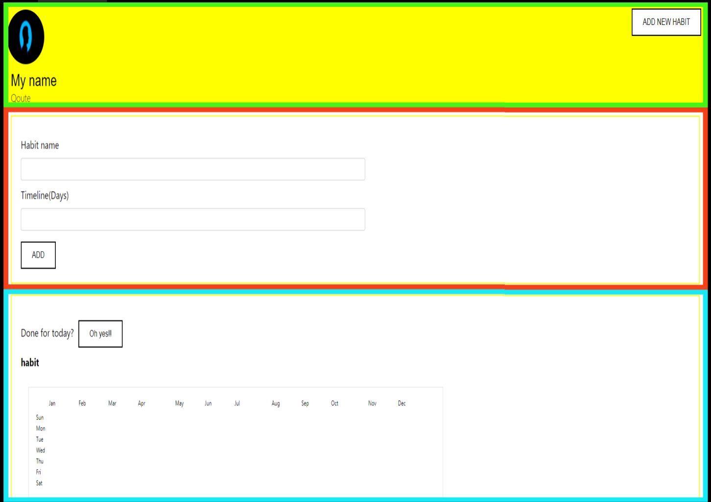

# Welcome to  Habit tracker App Tutorial
***
### What this app does?
**This app is basically a habit tracker app that uses github contribution graph as its inspiration to mark the graph daily can help you form new habits.** The idea of this app came to my mind when I started learning development and contributing actively on github. It was my motivation to make something daily and commit on github to keep that graph green. It really motivated me to code daily. So I thought of extending this to other habits. We all know how difficult it is to keep track of habits and continue them for long. 

## Who is this tutorial for?
This is a beginner-friendly tutorial. It aims to get you familiar with react focused development. You will be learning about JSX, React-dom, React hooks and an additional about CSS layout.
# Lets Get Started...
#### 1.**What is React ?**
React is a javascript framework. Frameworks are basically platforms for developing software applications. It is built-on top of programming language as base. For eg- React and angular are javscript frameworks, Django and Flask are python frameworks. Every framework is designed for specific purpose. React is developed by Facebook to design reusable user interface(UI). 

#### 2.**React- My Simple Understanding**
Projects or softwares need to modular. Modular means dividing or designing the components individually and then assembling to make the complete softwares. It provides us the great benefits. Firstly, when a team is working on a software it is one big challenge to divide work and work efficiently without merge conflicts;) 
React revolves around the philosophy of dividing the whole interface into vaible components that are independently made and dependency added later. This consequently also reduces the redundancy of making the same components time and again. Taking example, You have to develop software which has the same footer component on each of their different websites. How tedious of a task it would be to rewrite and maintain the whole code many times. React is a boon in that term.

#### 3.**Habit Tracker App Overview**
Let's have a look at what we are going to build in this tutorial and it's interpretation the react way.





The boxes(red,green and blue) you see mark the different components we have made individually.

The first box in green you see is the **profile.js** file in our porject. It shows the user profile photo, name and maybe their favorite qoute. It also has the **ADD HABIT** button. 

The add button will navigate you to the second component in red. It is the **inputbox.js** in our project. It is a simple form to you to input your habit name and time duration you are aiming to follow it.

On clicking the add button, a new habit will be added with a associated graph that you will have to mark daily that you completed or did the task.
The third and the last component in the green box is our **progresschart.js** file of our project.On clicking the "OH yes!!" button you will the change in your graph. The graph blocks will turn green.

#### 4.File Structure
We will be working in the src folder. So the change is confined to the src folder.


#### 5. Start Creating
To setup your basic react boiler plate use the command :
```sh
Create-react-app habit_tracker
```
Refer to the following document, if you are creating react-app for the first time.

[Setup react](https://docs.google.com/document/d/1C6-f56G1dMCv9cs89lknZYiyz_wqCADUBilniqjVKfk/edit?usp=sharing)


You should cd(change directory) to habit_tracker and use command to start the server:
```sh
npm start
```
Now, if you explore the file structure, you will have to delete some files in the src folder and add the files and folder according to the above file structure.

We will be making the components and walk through their code.
The **index.js** is our main file which is being rendered. It connects all other components with the **index.html** file in the public folder.
The **app.js** file contains all the components. It acts as the assembly point where we import all the components and finally export it as a whole to the index.js file.

index.js
```sh
import React from 'react';
import ReactDOM from 'react-dom';
import App from './App';

ReactDOM.render(<App/>,document.getElementById('root'));
```

App.js
```sh
import React from 'react';
import './App.css';
import Profile from './components/profile';


function App() {
  return ( 
    <div className="App"> 
    <Profile/> 
    </div>
    
  );
}

export default App;

```

You can see the App.js file just has the Profile component. The furthur components are rendered based on events.

#### 6. Creating components
We majorly have 3 different components. We have made the .js file for our jsx code and the css file for styling. 
Lets start with the most exciting and interesting part that is the graph. I was searching around to get some help and I came across, this really awesome tutorial by **Ire Aderinokun** on recreating github contribution graph. I have referred the same article to create the graph component.
link -- (Link to the article)

Progresschart.js
```sh
import React, { useState } from 'react';
import './progresschart.css';
function Progresschart(){
        const [count,setCount] = useState(0);
        var add=[];
         for(var i=0;i<count;i++)
            {
                add.push(<li data-level="2"></li>); 
            }
          
    
        return(
            <>
            <div className="box">
            <label className="label">Done for today?</label>
            <button className="button" onClick={() => setCount(count+1)}>Oh yes!!</button><br/>
            <h4 className="label">habit</h4>
            <div className="graph_box">
             <div className="graph">
             <ul className="months">
             <li>Jan</li>
             <li>Feb</li>
             <li>Mar</li>
             <li>Apr</li>
             <li>May</li>
             <li>Jun</li>
             <li>Jul</li>
             <li>Aug</li>
             <li>Sep</li>
             <li>Oct</li>
             <li>Nov</li>
             <li>Dec</li>
             </ul>
    
            <ul className="days">
            <li>Sun</li>
            <li>Mon</li>
            <li>Tue</li>
            <li>Wed</li>
            <li>Thu</li>
            <li>Fri</li>
            <li>Sat</li>
            </ul>
            <ul className="squares">
                {add.map(row => row)}
            </ul>
        </div>
        </div>
        </div>
        </>
                );
    

}

export default Progresschart;
```
You should refer the progresschart.css in the repo for the styling.We would be just dealing with the react part of it.
In react the class is className. We have used the react hook - **useState** to add the coloring to the graph. Each time the "Oh yes!!" button is clicked the state is changed as you can see we are doing a plus 1. So everytime the state changes just the component is rerendered with the update. We have used the simple for loop to add the green block list item on increase of count.

Next is our profile component. It is mostly static. It will take the name and qoute of the user once its connected to the backend. The add habit button is toggle button which hides and displays the add habit form(inputbox component).

Profile.js
```sh
import React, {useState} from 'react';
import './profile.css';
import img from './../assets/profile.png';
import Inputbox from './inputbox';
function Profile()
{
  const [habit,setHabit] = useState(false);
  
  const addhabit = () => {
    setHabit(!habit);
  }   
    return(
      <>
      <div className="profile_box">
      </img>
      <div className="name" >My name</div>
      <div className="Qoute">Qoute</div>
      <button className="addhabit" onClick={addhabit}>ADD NEW HABIT</button>
      </div>
      {habit && <Inputbox/>}
      </>
    )
}

export default Profile;
```

We have used the useState hook again but this time you can see it takes the state value as a boolean. In react the javascript part is returned using "{}". The "&&" operator toggles between displaying the form.

The add habit form for now just displays a single progress chart. It would render all the habits progress chart once it is connected to the backend. As we are just working on designing the frontend for now, we won't bother about that.

Inputbox.js
```sh
import React,{useState } from 'react';
import './inputbox.css';
import Progresschart from './progress_chart';
function Inputbox(){
    const [addhabit,setAddhabit] = useState(false);
  
    const addhabitfunc = () => {
    setAddhabit(!addhabit);
    }

        return(
            <>
            <div className="box">
            <label className="label">Habit name</label><br/>
            <input className="input" ></input><br/>
            <label className="label">Timeline(Days)</label><br/>
            <input className="input"></input><br/>
            <button className="button" onClick={addhabitfunc}>ADD</button>
           
            </div>
            {addhabit && <Progresschart />}
            </>
        )}


export default Inputbox;
```
A similar implementation that of add habit can be seen in the inputbox too.
We have not discussed the css styling. For that you should refer the css files in the repo.
There are certain things that I would like to highlight. The html style code you see here is not exactly html but JSX. JSX is syntax extension to javascript. JSX is the XML of javascript. The react-dom uses virtual dom to render components on update. In react, previously class components were popular but recently functional components have gained popularity. We have just used functions to create our components.

Hope you enjoyed craeting this simple react application. Will make the complete application by making it fully functional by adding the backend in future.

Happy Coding!!


